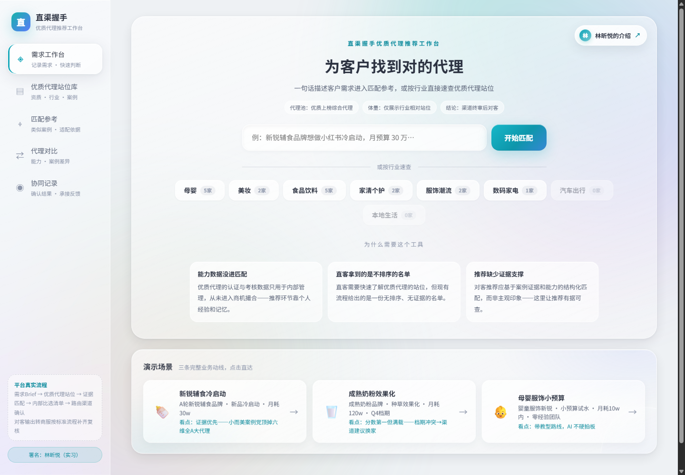

<div align="center">

# 直渠握手 · 优质代理推荐工作台

以案例证据、代理资质、服务能力和预算适配为依据，把客户需求转化为可解释的代理推荐。

[](https://github.com/linxyannie-hub/channel-nexus/actions/workflows/pages.yml)
[](https://github.com/linxyannie-hub/channel-nexus/actions/workflows/validate.yml)
[](LICENSE)

[在线体验](https://linxyannie-hub.github.io/channel-nexus/) · [功能说明](#核心功能) · [参与贡献](CONTRIBUTING.md) · [问题反馈](https://github.com/linxyannie-hub/channel-nexus/issues/new/choose)

</div>



> [!NOTE]
> 这是用于产品演示与方案评审的纯前端原型。页面中的代理、案例、评分和推荐结果均为演示数据，不应直接作为真实业务决策或对客承诺。

## 为什么做这个项目

渠道选型常常依赖分散的信息和个人经验。这个工作台将需求 Brief、候选代理、案例证据、能力评分和渠道反馈放入一条可回溯的流程，让“为什么推荐这家”能够被说明、比较与复盘。

## 核心功能

- **需求结构化**：从一句话需求提取行业、品牌阶段、目标、预算和投放形式。
- **证据优先推荐**：综合同类案例、认证资质、服务能力与预算适配计算匹配分。
- **代理站位库**：按行业、类型、承接状态和能力标签筛选候选代理。
- **横向对比**：通过能力雷达、经营指标和案例证据比较最多三家代理。
- **协同闭环**：模拟渠道确认、冲突换家和结果回流，展示数据飞轮。

## 快速开始

无需安装依赖或构建，任选一种方式运行：

```bash
# Python
python -m http.server 8000

# Node.js
npx serve .
```

随后访问 <http://localhost:8000>。也可以直接双击 `index.html`，但本地服务器更接近线上环境。

## 使用流程

1. 在首页输入客户需求，或选择一个演示场景。
2. 检查并补全系统生成的结构化 Brief。
3. 查看推荐依据、合规检查和候选代理。
4. 勾选候选方进行横向对比，再模拟建联路由。
5. 在“协同记录”查看本次操作形成的反馈数据。

## 技术与架构

项目采用零构建的单文件架构：HTML、CSS、演示数据和原生 JavaScript 均位于 `index.html`。它没有后端、数据库或登录系统，也不会持久化用户输入。

```text
浏览器输入 → Brief 解析 → 硬性筛选 → 多维评分 → 推荐与对比 → 路由反馈
```

| 组成 | 说明 |
| --- | --- |
| 页面与样式 | 语义化 HTML + 原生 CSS |
| 交互与评分 | 原生 JavaScript，无第三方运行时依赖 |
| 数据 | 内嵌演示数据，刷新页面后重置 |
| 部署 | GitHub Pages 自动发布 |

## 项目结构

```text
.
├── .github/              # CI、Pages 与协作模板
├── docs/                 # README 预览素材
├── index.html            # 完整应用入口
├── CHANGELOG.md          # 版本变更记录
├── CODE_OF_CONDUCT.md    # 社区行为准则
├── CONTRIBUTING.md       # 贡献指南
├── SECURITY.md           # 安全问题报告方式
└── LICENSE               # MIT License
```

## 数据与隐私

- 仓库不包含 API 密钥、账户凭据或服务端连接。
- 页面不会将输入保存到服务器；刷新页面会重置状态。
- 页面保留作者介绍的外部链接，点击后会离开本站。
- 用真实业务数据替换演示数据前，请完成授权、脱敏和合规审查。

## Roadmap

- [ ] 将演示数据拆分为可维护的数据文件
- [ ] 增加数据导入、导出与字段校验
- [ ] 增加自动化浏览器测试和无障碍检查
- [ ] 对接权限、审计和持久化服务
- [ ] 支持评分权重配置与版本追踪

## 贡献与安全

欢迎提交 Issue 和 Pull Request。开始前请阅读 [贡献指南](CONTRIBUTING.md) 与 [行为准则](CODE_OF_CONDUCT.md)。安全漏洞请不要公开提交 Issue，处理方式见 [安全政策](SECURITY.md)。

## License

本项目基于 [MIT License](LICENSE) 开源。
